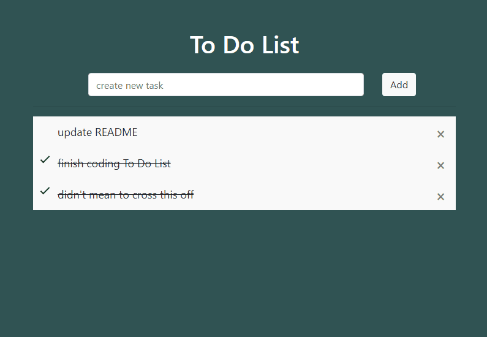
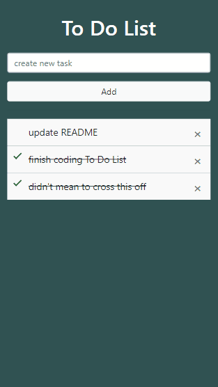

# To Do List
Creating a To-do List App with Node.js + Express and PostgreSQL database

## Table of Contents
* [Technologies Used](#technologies-used)
* [Features](#features)
* [Demos](#demos)
* [Setup](#setup)
* [Acknowledgements](#acknowledgements)

## Technologies Used
- dotenv - version 10.0.0 - Loads environment variables from .env file
- ejs -  version 3.1.6 - Embedded JavaScript templates
- express - version 4.17.2 - Node.js web application framework
- knex - version 0.95.15 - SQL query & schema builder for PostgresSQL
- nodemon - version 2.0.15 - Simple monitor script for use during development of a node.js app
- pg - version 8.7.1 - PostgreSQL
- save - version 2.4.0 - CRUD based persistence abstraction for storing objects to any backend data store
- bootstrap - version 4 - HTML, CSS, and JavaScript framework

## Features
- Add, complete, or delete tasks on a single page
- Store tasks in Postgres database with status { 0: incomplete, 1: complete }
- Delete tasks from Postgres database

## Demos 
| Widescreen | Smartphone |
| --- | --- |
|  |  |

## Setup
#### Initialize the project
- Using Git Bash, navigate to the project repo and run `mkdir todolist`
- In the todolist directory run `npm init`
- Fill out the required information to initialize the project

#### Installations
Install Postgres on your computer [here](https://www.postgresql.org/).

Using Git Bash, run the following commands:
- express `npm install express — save`
- ejs `npm install ejs --save`
- knex `npm install knex`
- pg `npm install pg`
- dotenv `npm install dotenv`

#### Creating and Connecting to Database
After installing Postgres, open SQL shell and create a table 

```
CREATE TABLE list(
id SERIAL PRIMARY KEY NOT NULL,
task text UNIQUE,
status INTEGER DEFAULT 0
);
```

Connect to the database by including the following in server.js
```
require('dotenv').config(); 
const express = require("express");
const knex = require('knex');

const db = knex({
    client: 'pg', // postgres
    connection: 
        host: process.env.HOST,
        port: process.env.PORT,
        user: process.env.USER,
        password: process.env.PASSWORD,
        database: process.env.NAME
    }
});
```

Your secrets exist in a .env file within the todolist directory
```
HOST="127.0.0.1" // using localhost
PORT="YOUR PORT"
USER = "postgres" // default user
PASSWORD="YOUR PASSWORD"
NAME="postgres" // default database name
```

#### Structure
The todolist directory should have the following folder structure


## Acknowledgements
- This project was based on [this tutorial](https://codeburst.io/creating-a-todo-app-with-node-js-express-and-postgresql-database-6dbf80c3fe9c).
